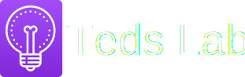

  
  
  **My web lab to tinker with tech**
  
  [www.tedslab.com](https://tedslab.com)

## Development

### Prerequisites

The app depends on a few utilities which you will need to install before you begin.

#### [PostgreSQL](https://www.postgresql.org/) (Version 13)

Install following the [official PostgreSQL installation guide](https://www.postgresql.org/docs/current/tutorial-install.html).

#### [Node.js](https://nodejs.org) and [Yarn](https://yarnpkg.com)

Yarn is used to manage frontend dependencies for the project. It can be installed by following [the official installation guide](https://yarnpkg.com/lang/en/docs/install/). You will also need to [install Node.js](https://nodejs.org/en/download/package-manager/).

#### [Ruby](https://www.ruby-lang.org)

Install the [current project ruby version](./.ruby-version), preferrably with
[a Ruby version manager like chruby, rbenv, rvm](https://www.ruby-toolbox.com/categories/ruby_version_management), or [uru if you're using windows](https://bitbucket.org/jonforums/uru/wiki/Home).

You will also need [Bundler](http://bundler.io/) for installing the project's dependencies.

### Running the application

1. Start postgres
1. Install the project's dependencies and prepare the database with `bin/setup`
1. Run the app with `rails server`. You can access the site at `http://localhost:3000`

## Production

The app is using [Heroku](heroku.com) to run in production. Heroku is still new to me so I'm learning how this should be effectively set up. Instructions will be added here in the future.

## Additional information

### Helpful resources

* **[gravit.io](gravit.io)** - Gravit allows you to create illustrations. Then export them into many different formats. For me, this is where I created the Teds Lab logo. Exporting into an SVG was free too.
